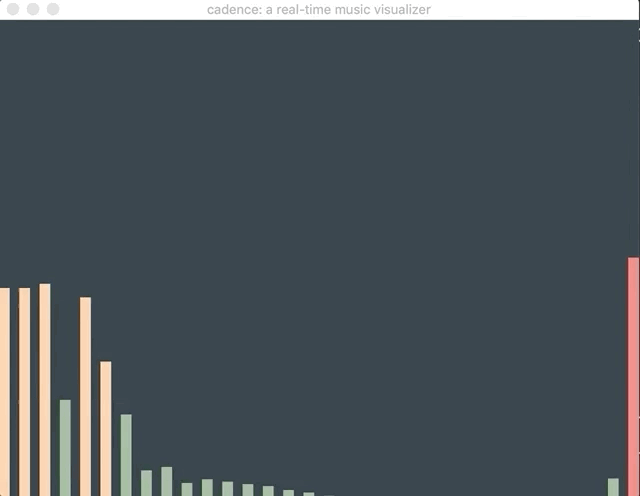

# cadence 🎶

A real-time music visualizer using OpenGL. Final project for Computer Graphics (Fall 2019).

<p align="center">
  
</p>

## To run:

```
mkdir build
cd build
cmake -DCMAKE_BUILD_TYPE=Release ..
make
./cadence <filename>
```
**Note:** audio file should be placed in `/sounds`

## How it works:
- Incoming audio stream from a local file is read in fixed-size chunks
- Fast Fourier Transform is done on each chunk to extract frequency data
- FFT coefficients are grouped into corresponding frequency ranges (32 by default)
- Time smoothing is applied to each range to avoid a jittery display
- Each frequency range is drawn as a bar with colors changing based on its height